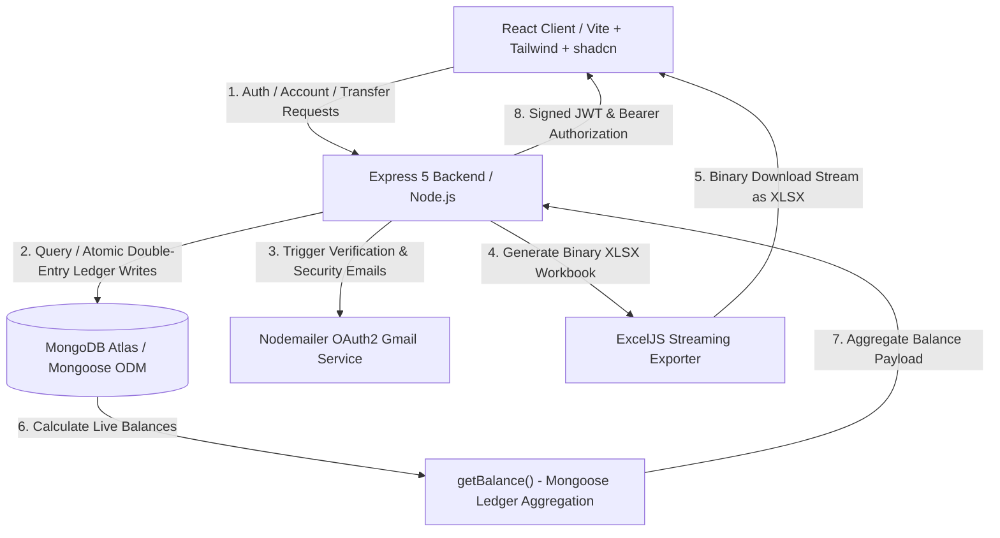
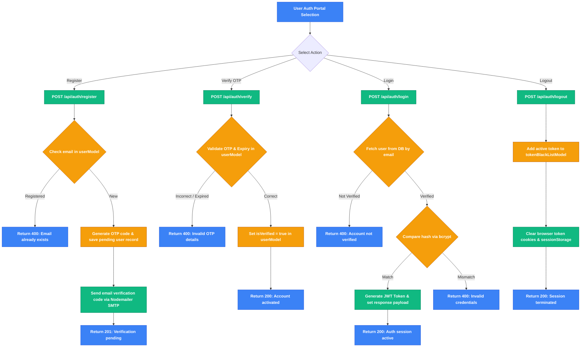
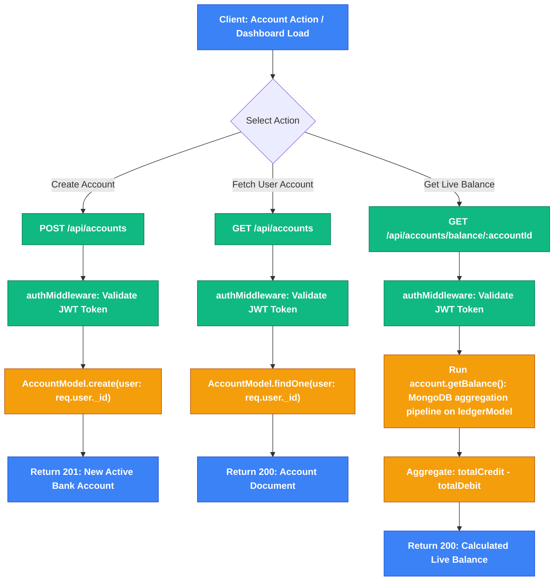
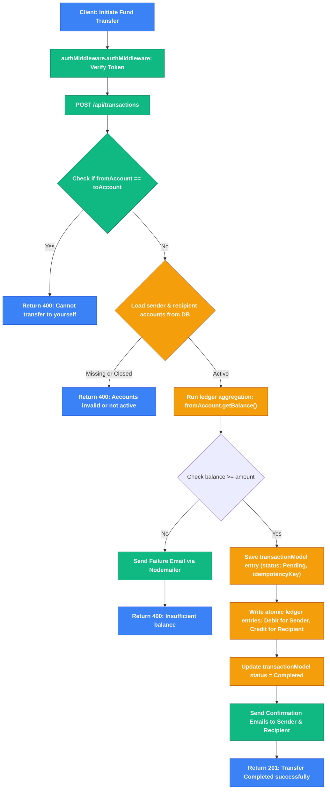
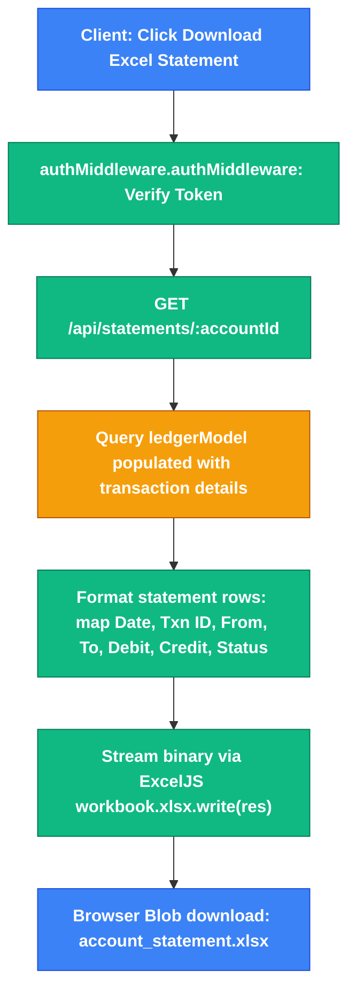
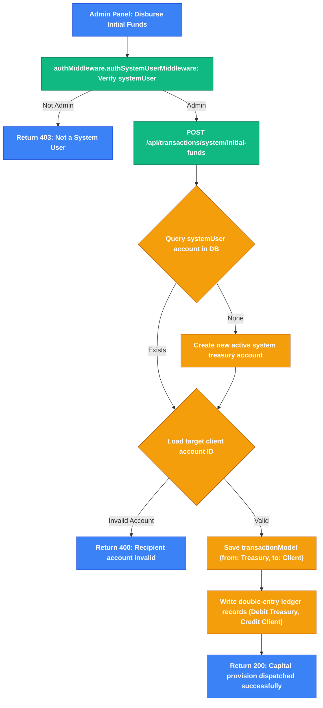

# 🚀 Backend Ledger: Double-Entry MERN Ledger & Banking System

<div align="center">


An advanced, minimal, and modern **full-stack banking & ledger web application** built with React, Tailwind CSS, shadcn/ui primitives, Node.js, Express 5, and MongoDB Atlas. Features secure email OTP verification, tab-isolated session security, live account balances computed from double-entry ledger entries, interactive Recharts analytics, instant fund transfers, Excel statement generation, and a System Treasury workspace.

</div>

---

## 🗺️ System Architecture

The diagram below details the data flow and coordination between the React client, the Express 5 Node.js API server, and MongoDB database services:



---

## ✨ Core Features

### 🔐 Secure User Authentication & Verification
* **OTP Sign-Up & Password Reset**: 6-digit email OTP verification powered by Nodemailer & Gmail OAuth2.
* **Inline Validation**: React Hook Form + Zod validation with live password strength indicators and criteria checklists.
* **Token Blacklisting**: Logout invalidates JWT tokens via an indexed MongoDB token blacklist model.
* **Tab-Isolated Sessions**: Uses `sessionStorage` and an Axios `Authorization: Bearer <token>` interceptor to allow multiple accounts to run concurrently in separate browser tabs without session collision.

### 💼 Bank Account Provisioning & Management
* **Instant Account Opening**: One-click opening of bank accounts bound to authenticated user documents.
* **Double-Entry Ledger Aggregations**: Account balances are dynamically calculated from immutable debit and credit ledger entries via MongoDB aggregation pipelines.
* **Account Identifiers**: Masked account numbers with 1-click clipboard copy functionality.

### 📊 Live Account Dashboard & Recharts Analytics
* **Overview Cards**: Shows active account details, holder information, currency references, and toggleable balance visibility.
* **Live Stat Indicators**: Real-time cards for Current Balance, Total Transactions count, Last Transaction timestamp, and Account Status.
* **Cash Flow Trend (`AreaChart`)**: Visualizes Credits (received) vs Debits (sent) over time using Recharts.
* **Fund Distribution (`PieChart`)**: Interactive donut chart displaying received vs sent fund ratios.

### 💸 Instant Fund Transfer System
* **Pre-Submission Validation**: Live client & server checks for account existence, active status, and available balance.
* **Confirmation Dialog**: Interactive review modal before executing fund transfers.
* **Idempotency Protection**: Unique UUID-based idempotency keys prevent duplicate charges.

### 📜 Transaction History & Audit (`/transactions`)
* **Search & Multi-Filter**: Search transactions by ID or account ID, with dropdown filters for Type (Credit/Debit) and Status (Completed, Pending, Failed, Reversed).
* **Audit Modal**: Click any transaction row to view complete details, full counterparty account IDs, timestamps, and idempotency keys.

### 📄 Official Account Statement Exporter (`/statements`)
* **Excel (.xlsx) Export**: One-click download of official account statements generated and streamed dynamically via ExcelJS.

### 🛡️ System Treasury & Capital Injection Workspace (`/admin-dashboard`)
* **Role-Based Routing**: System users (`systemUser: true`) are automatically routed to the Admin Dashboard upon authentication.
* **Unlimited Capital Disbursement**: Dedicated system endpoint (`/api/transactions/system/initial-funds`) allows initial capital seeding to client accounts without balance limits.

---

## 📁 Repository Directory Structure

```text
├── backend/
│   ├── src/
│   │   ├── config/              # Database ODM configuration
│   │   │   └── db.js
│   │   ├── contollers/          # API route controllers
│   │   │   ├── account.controller.js
│   │   │   ├── auth.controller.js
│   │   │   ├── statement.controller.js
│   │   │   └── transaction.controller.js
│   │   ├── middlewares/         # Auth guards & middleware
│   │   │   └── auth.middleware.js
│   │   ├── models/              # Mongoose database models
│   │   │   ├── accountModel.js
│   │   │   ├── ledger.Model.js
│   │   │   ├── tokenBlackListModel.js
│   │   │   ├── transaction.model.js
│   │   │   └── userModel.js
│   │   ├── routes/              # Express route definitions
│   │   │   ├── account.routes.js
│   │   │   ├── auth.js
│   │   │   ├── statement.routes.js
│   │   │   └── transcation.routes.js
│   │   ├── services/            # Email & UUID services
│   │   │   ├── email.service.js
│   │   │   └── uuid.service.js
│   │   └── index.js
│   ├── server.js
│   └── package.json
└── frontend/
    ├── src/
    │   ├── components/
    │   │   ├── layout/
    │   │   │   └── AppLayout.jsx  # App shell with Sidebar & Navbar
    │   │   └── ui/                # shadcn/ui primitives (Button, Card, Dialog, Toast...)
    │   ├── hooks/
    │   │   └── use-toast.js
    │   ├── pages/
    │   │   ├── Register.jsx
    │   │   ├── VerifyOtp.jsx
    │   │   ├── Login.jsx
    │   │   ├── ForgotPassword.jsx
    │   │   ├── ResetPassword.jsx
    │   │   ├── Dashboard.jsx      # Dashboard with Recharts
    │   │   ├── Transfer.jsx       # Transfer Money
    │   │   ├── Transactions.jsx   # Transaction History & Search
    │   │   ├── Statements.jsx     # Excel Export
    │   │   └── AdminDashboard.jsx # System Admin workspace
    │   ├── services/
    │   │   └── api.js             # Axios client with interceptors
    │   ├── App.jsx
    │   ├── main.jsx
    │   └── index.css              # Purple design system & tokens
    ├── index.html
    ├── vite.config.js
    └── package.json
```

---

## ⚙️ Prerequisites & Environment Variables

Create a file named `.env` inside the `backend` directory:

```env
# Server Port
PORT=3000

# MongoDB Connection String
MONGODB_URI=mongodb://localhost:27017/banking-system

# JWT Hashing Secret
Jwt_Secret=your_super_secret_jwt_key_here

# Nodemailer OAuth2 Credentials (Gmail)
EMAIL_USER=your_email@gmail.com
CLIENT_ID=your_google_oauth_client_id
CLIENT_SECRET=your_google_oauth_client_secret
REFRESH_TOKEN=your_google_oauth_refresh_token
```

---

## 🚀 Getting Started

Follow these steps to set up and run the application locally:

### 1. Start the Backend API Server
Navigate to the `backend` folder, install npm packages, and start Nodemon:
```bash
cd backend
npm install
npm start
```
*(The backend server will connect to MongoDB and start listening on port `3000`)*

### 2. Start the Frontend Client
Open a new terminal window, navigate to the `frontend` folder, install npm packages, and launch Vite:
```bash
cd frontend
npm install
npm run dev
```
*(The client application will start running on port `5173`)*

---

## 🔌 Core API Specifications

| Method | Endpoint | Description | Auth Required |
| :--- | :--- | :--- | :--- |
| **POST** | `/api/auth/register` | Registers a new user account and sends verification OTP | No |
| **POST** | `/api/auth/verify` | Verifies user email using the 6-digit OTP code | No |
| **POST** | `/api/auth/login` | Authenticates credentials and returns JWT token | No |
| **POST** | `/api/auth/logout` | Clears session cookie and blacklists active token | Yes |
| **POST** | `/api/auth/resend` | Resends activation OTP email | No |
| **POST** | `/api/auth/resetotp` | Generates a password recovery OTP email | No |
| **POST** | `/api/auth/resetpass` | Verifies recovery OTP and updates user password | No |
| **POST** | `/api/accounts` | Creates a new customer bank account for authenticated user | Yes |
| **GET** | `/api/accounts` | Fetches customer account associated with authenticated user | Yes |
| **GET** | `/api/accounts/balance/:accountId` | Aggregates double-entry ledger to calculate live balance | Yes |
| **POST** | `/api/transactions` | Initiates fund transfers between active customer accounts | Yes |
| **POST** | `/api/transactions/system/initial-funds` | Dispatches capital provisions from system treasury | Yes (Admin) |
| **GET** | `/api/statements/:accountId` | Generates and streams account statement Excel workbook (.xlsx) | Yes |
| **GET** | `/api/statements/history/:accountId` | Retrieves full ledger history for analytics and search | Yes |

---

## 🔄 Detailed Feature & API Workflows

This section details the step-by-step execution flow for every application feature and API request, complete with interactive Mermaid diagrams mapping frontend triggers directly to backend controllers, MongoDB schemas, and ledger engines.

---

### 🔑 1. User Authentication & OTP Verification Flow
Manages registration, 6-digit email OTP validation, sign-ins, and session blacklists.

#### 🛠️ Files Involved:
* **Routes**: [auth.js](file:///c:/Users/mibni/OneDrive/Desktop/Banking%20System/backend/src/routes/auth.js)
* **Controller**: [auth.controller.js](file:///c:/Users/mibni/OneDrive/Desktop/Banking%20System/backend/src/contollers/auth.controller.js)
* **Model**: [userModel.js](file:///c:/Users/mibni/OneDrive/Desktop/Banking%20System/backend/src/models/userModel.js), [tokenBlackListModel.js](file:///c:/Users/mibni/OneDrive/Desktop/Banking%20System/backend/src/models/tokenBlackListModel.js)
* **Service**: [email.service.js](file:///c:/Users/mibni/OneDrive/Desktop/Banking%20System/backend/src/services/email.service.js)
* **Auth Guard Middleware**: [auth.middleware.js](file:///c:/Users/mibni/OneDrive/Desktop/Banking%20System/backend/src/middlewares/auth.middleware.js)

#### 📝 Step-by-Step Flow:
1. **Registration**:
   * Client posts name, email, and password to `POST /api/auth/register`.
   * Backend checks if the email exists in [userModel](file:///c:/Users/mibni/OneDrive/Desktop/Banking%20System/backend/src/models/userModel.js). If unique, it generates a 6-digit OTP code (`userSchema.statics.generateOtp`), sets an expiry date (5 mins), hashes the password via bcrypt, and saves the user record (`isVerified: false`).
   * `emailService.sendRegistrationEmail` triggers an email to the user via Nodemailer OAuth2.
2. **OTP Verification**:
   * Client submits the OTP code to `POST /api/auth/verify`.
   * Backend queries `userModel` (selecting `+otp +otpExpiry`), verifies code equality and expiry, and updates `isVerified = true`.
3. **Login & Role Detection**:
   * Client submits credentials to `POST /api/auth/login`.
   * Backend verifies password hash via `bcrypt.compare`. On match, it generates a signed JWT token and responds with user metadata and token.
   * Frontend probes system endpoints using the token to determine if the user is a `systemUser`, navigating them to `/admin-dashboard` or `/dashboard`.
4. **Logout & Blacklisting**:
   * Client posts to `POST /api/auth/logout`.
   * Backend extracts the token from `Authorization` header or cookie, records it in [tokenBlackListModel](file:///c:/Users/mibni/OneDrive/Desktop/Banking%20System/backend/src/models/tokenBlackListModel.js), clears cookies, and responds with 200 OK.



---

### 💼 2. Bank Account Provisioning & Balance Aggregation Flow
Handles creating customer bank accounts and computing live balances from the double-entry ledger.

#### 🛠️ Files Involved:
* **Routes**: [account.routes.js](file:///c:/Users/mibni/OneDrive/Desktop/Banking%20System/backend/src/routes/account.routes.js)
* **Controller**: [account.controller.js](file:///c:/Users/mibni/OneDrive/Desktop/Banking%20System/backend/src/contollers/account.controller.js)
* **Model**: [accountModel.js](file:///c:/Users/mibni/OneDrive/Desktop/Banking%20System/backend/src/models/accountModel.js), [ledger.Model.js](file:///c:/Users/mibni/OneDrive/Desktop/Banking%20System/backend/src/models/ledger.Model.js)
* **Auth Guard**: [auth.middleware.js](file:///c:/Users/mibni/OneDrive/Desktop/Banking%20System/backend/src/middlewares/auth.middleware.js)

#### 📝 Step-by-Step Flow:
1. **Create Account**:
   * Client posts to `POST /api/accounts`.
   * `authMiddleware` validates JWT token.
   * `createAccountController` creates a new document in [AccountModel](file:///c:/Users/mibni/OneDrive/Desktop/Banking%20System/backend/src/models/accountModel.js) bound to `req.user._id` with status `"Active"` and default currency `"INR"`.
2. **Fetch Customer Account**:
   * Client issues `GET /api/accounts`.
   * Backend queries `AccountModel.findOne({ user: req.user._id })` and returns account metadata.
3. **Calculate Live Balance**:
   * Client calls `GET /api/accounts/balance/:accountId`.
   * Backend calls `accountSchema.methods.getBalance()` on the Mongoose model instance.
   * The Mongoose method executes a MongoDB aggregation pipeline on `ledgerModel`:
     - `$match`: matches entries where `account == accountId`
     - `$group`: calculates `totalDebit` (sum of Debit entries) and `totalCredit` (sum of Credit entries)
     - `$project`: returns `balance = totalCredit - totalDebit`
   * Backend responds with `{ accountId, balance }`.



---

### 💸 3. Double-Entry Transaction Processing Flow
Examines isolation checks, debit validation, atomic transaction records, and double-entry ledger creation.

#### 🛠️ Files Involved:
* **Routes**: [transcation.routes.js](file:///c:/Users/mibni/OneDrive/Desktop/Banking%20System/backend/src/routes/transcation.routes.js)
* **Controller**: [transaction.controller.js](file:///c:/Users/mibni/OneDrive/Desktop/Banking%20System/backend/src/contollers/transaction.controller.js)
* **Models**: [transaction.model.js](file:///c:/Users/mibni/OneDrive/Desktop/Banking%20System/backend/src/models/transaction.model.js), [ledger.Model.js](file:///c:/Users/mibni/OneDrive/Desktop/Banking%20System/backend/src/models/ledger.Model.js), [accountModel.js](file:///c:/Users/mibni/OneDrive/Desktop/Banking%20System/backend/src/models/accountModel.js)

#### 📝 Step-by-Step Flow:
1. **Initiate Transfer**:
   * Client submits `{ fromAccount, toAccount, amount }` to `POST /api/transactions`.
2. **Validation Guards**:
   * Verifies `fromAccount !== toAccount` (cannot transfer to self).
   * Verifies both `fromAccount` and `toAccount` exist in database and have status `"Active"`.
3. **Sender Balance Check**:
   * Runs `fromUserAccount.getBalance()` to derive available funds.
   * If `balance < amount`, it triggers a transaction failure email via Nodemailer and returns `400 Insufficient balance`.
4. **Atomic Transaction & Ledger Writes**:
   * Creates a `transactionModel` document with `status: "Pending"` and a unique `idempotencyKey`.
   * Creates two atomic double-entry ledger entries in `ledgerModel`:
     - Entry 1: `{ account: fromAccount, amount, transaction: txn._id, type: "Debit" }`
     - Entry 2: `{ account: toAccount, amount, transaction: txn._id, type: "Credit" }`
   * Updates `transactionModel` status to `"Completed"`.
   * Triggers transaction success emails to both sender and recipient.
   * Returns `201 Created` with full transaction details.



---

### 📑 4. Live Statement Workbook Exporter Flow
Aggregates double-entry ledger rows and streams formatted Excel spreadsheets dynamically.

#### 🛠️ Files Involved:
* **Routes**: [statement.routes.js](file:///c:/Users/mibni/OneDrive/Desktop/Banking%20System/backend/src/routes/statement.routes.js)
* **Controller**: [statement.controller.js](file:///c:/Users/mibni/OneDrive/Desktop/Banking%20System/backend/src/contollers/statement.controller.js)
* **Model**: [ledger.Model.js](file:///c:/Users/mibni/OneDrive/Desktop/Banking%20System/backend/src/models/ledger.Model.js)

#### 📝 Step-by-Step Flow:
1. **Export Request**:
   * Client requests `GET /api/statements/:accountId`.
2. **Query Ledger Entries**:
   * Controller queries `ledgerModel.find({ account: accountId }).populate("transaction").sort({ createdAt: -1 })`.
3. **ExcelJS Streaming Construction**:
   * Initializes `new ExcelJS.Workbook()` and adds a worksheet named `"Statement"`.
   * Configures column headers: `Date`, `Transaction ID`, `From`, `To`, `Debit`, `Credit`, `Status`.
   * Iterates through populated ledger entries, mapping amounts into Debit or Credit columns based on whether `fromAccount` matches `accountId`.
4. **Binary Stream Response**:
   * Sets response headers `Content-Type: application/vnd.openxmlformats-officedocument.spreadsheetml.sheet` and `Content-Disposition: attachment; filename=account_statement.xlsx`.
   * Streams `workbook.xlsx.write(res)` directly to the client browser.



---

### 🛡️ 5. System Treasury Capital Injection Flow
Injects initial funds from the system treasury account to client accounts without balance constraints.

#### 🛠️ Files Involved:
* **Routes**: [transcation.routes.js](file:///c:/Users/mibni/OneDrive/Desktop/Banking%20System/backend/src/routes/transcation.routes.js)
* **Controller**: [transaction.controller.js](file:///c:/Users/mibni/OneDrive/Desktop/Banking%20System/backend/src/contollers/transaction.controller.js)
* **Middleware**: [auth.middleware.js](file:///c:/Users/mibni/OneDrive/Desktop/Banking%20System/backend/src/middlewares/auth.middleware.js) (`authSystemUserMiddleware`)

#### 📝 Step-by-Step Flow:
1. **Admin Authorization Guard**:
   * Client posts to `POST /api/transactions/system/initial-funds`.
   * `authSystemUserMiddleware` checks token, loads user from database selecting `+systemUser`, and verifies `user.systemUser === true`. If false, returns `403 Forbidden: not a System User`.
2. **Treasury Account Retrieval**:
   * Controller checks if a treasury bank account exists for the system user. If not, it creates a new active treasury account automatically.
3. **Capital Dispatch (No Balance Limit)**:
   * Bypasses sender balance check (system treasury has infinite capital).
   * Validates target recipient account status.
   * Creates `transactionModel` entry and double-entry `ledgerModel` records (Debit for Treasury, Credit for Recipient).
   * Updates transaction status to `"Completed"` and returns `200 OK`.



