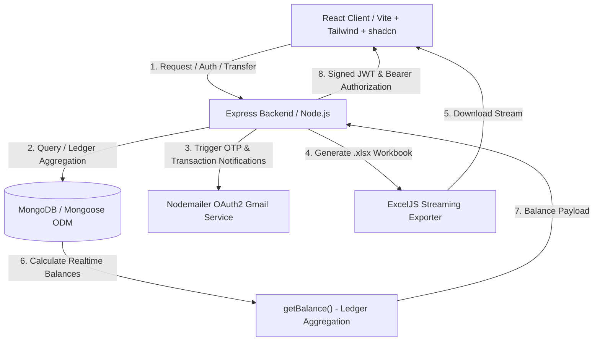

# 🚀 Backend Ledger: Full-Stack Banking & Ledger System

<div align="center">


An advanced, minimal, and modern **full-stack banking web application** built with React, Tailwind CSS, shadcn/ui, Node.js, Express, and MongoDB. Features secure OTP authentication, tab-isolated session state, live account balances derived from double-entry ledger entries, Recharts data analytics, a dedicated fund transfer workflow, Excel statement exports, and a System Admin workspace.

</div>

---

## 🗺️ System Architecture



---

## ✨ Core Features

### 🔐 Secure Authentication & Verification
* **OTP Sign-Up & Password Reset**: 6-digit email OTP verification powered by Nodemailer & Gmail OAuth2.
* **Inline Validation**: React Hook Form + Zod validation with live password strength indicators and criteria checklists.
* **Token Blacklisting**: Logout invalidates JWT tokens via a MongoDB token blacklist schema.
* **Tab-Isolated Sessions**: Uses `sessionStorage` and an Axios `Authorization: Bearer <token>` interceptor to allow multiple accounts to run concurrently in separate browser tabs without cross-contamination.

### 📊 Modern Dashboard & Recharts Analytics
* **Account Overview Card**: Shows masked account number, copy-to-clipboard, holder details, status badge, and balance visibility toggle.
* **Live Stat Indicators**: Real-time cards for Current Balance, Total Transactions count, Last Transaction timestamp, and Account Status.
* **Cash Flow Trend (`AreaChart`)**: Visualizes Credits (received) vs Debits (sent) over time using Recharts.
* **Fund Distribution (`PieChart`)**: Interactive donut chart displaying received vs sent fund ratios.

### 💸 Instant Fund Transfer Workflow
* **Live Validation**: Pre-submission checks for account existence, active status, and available balance.
* **Confirmation Dialog**: Detailed review modal before executing fund transfers.
* **Idempotency Protection**: Unique idempotency keys prevent duplicate charges.

### 📜 Transaction History & Audit (`/transactions`)
* **Live Search & Filter**: Search transactions by ID or account ID, with dropdown filters for Type (Credit/Debit) and Status (Completed, Pending, Failed, Reversed).
* **Audit Modal**: Click any transaction row to view complete details, full account IDs, timestamps, and idempotency keys.

### 📄 Account Statements (`/statements`)
* **Excel (.xlsx) Export**: One-click download of official account statements generated via ExcelJS.

### 🛡️ System Admin Workspace (`/admin-dashboard`)
* **Role-Based Access**: System users (`systemUser: true`) are automatically routed to the Admin Dashboard upon login.
* **Unlimited Capital Disbursement**: Admin workspace allows initial fund seeding via `/api/transactions/system/initial-funds` without balance constraints.

---

## 📁 Repository Directory Structure

```text
├── backend/
│   ├── src/
│   │   ├── config/              # Database configuration
│   │   │   └── db.js
│   │   ├── contollers/          # API controllers
│   │   │   ├── account.controller.js
│   │   │   ├── auth.controller.js
│   │   │   ├── statement.controller.js
│   │   │   └── transaction.controller.js
│   │   ├── middlewares/         # Middleware & Guards
│   │   │   └── auth.middleware.js
│   │   ├── models/              # Mongoose models
│   │   │   ├── accountModel.js
│   │   │   ├── ledger.Model.js
│   │   │   ├── tokenBlackListModel.js
│   │   │   ├── transaction.model.js
│   │   │   └── userModel.js
│   │   ├── routes/              # Mounted Express routes
│   │   │   ├── account.routes.js
│   │   │   ├── auth.js
│   │   │   ├── statement.routes.js
│   │   │   └── transcation.routes.js
│   │   ├── services/            # Services
│   │   │   ├── email.service.js
│   │   │   └── uuid.service.js
│   │   └── index.js
│   ├── server.js
│   └── package.json
└── frontend/
    ├── src/
    │   ├── components/
    │   │   ├── layout/
    │   │   │   └── AppLayout.jsx  # App shell with Sidebar & Navbar
    │   │   └── ui/                # shadcn/ui primitives (Button, Card, Dialog, Toast...)
    │   ├── hooks/
    │   │   └── use-toast.js
    │   ├── pages/
    │   │   ├── Register.jsx
    │   │   ├── VerifyOtp.jsx
    │   │   ├── Login.jsx
    │   │   ├── ForgotPassword.jsx
    │   │   ├── ResetPassword.jsx
    │   │   ├── Dashboard.jsx      # Dashboard with Recharts
    │   │   ├── Transfer.jsx       # Transfer Money
    │   │   ├── Transactions.jsx   # Transaction History & Search
    │   │   ├── Statements.jsx     # Excel Export
    │   │   └── AdminDashboard.jsx # System Admin workspace
    │   ├── services/
    │   │   └── api.js             # Axios client with interceptors
    │   ├── App.jsx
    │   ├── main.jsx
    │   └── index.css              # Purple theme & design system
    ├── index.html
    ├── vite.config.js
    └── package.json
```

---

## ⚡ Quick Start

### 1. Clone & Configure Backend
```bash
cd backend
npm install
```
Create a `.env` file inside `backend/`:
```env
PORT=3000
MONGODB_URI=your_mongodb_connection_string
Jwt_Secret=your_jwt_secret
EMAIL_USER=your_email@gmail.com
CLIENT_ID=your_oauth_client_id
CLIENT_SECRET=your_oauth_client_secret
REFRESH_TOKEN=your_oauth_refresh_token
```

Start the backend:
```bash
npm start
```

### 2. Configure & Run Frontend
```bash
cd frontend
npm install
npm run dev
```
Open [http://localhost:5173](http://localhost:5173) in your browser.
