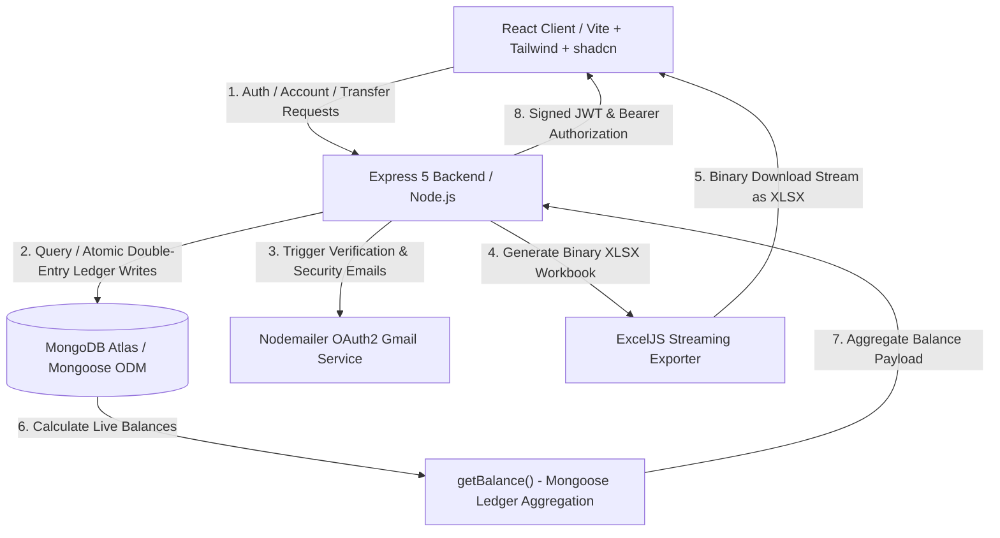
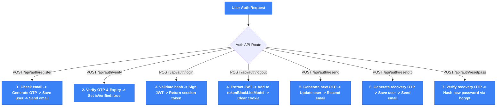
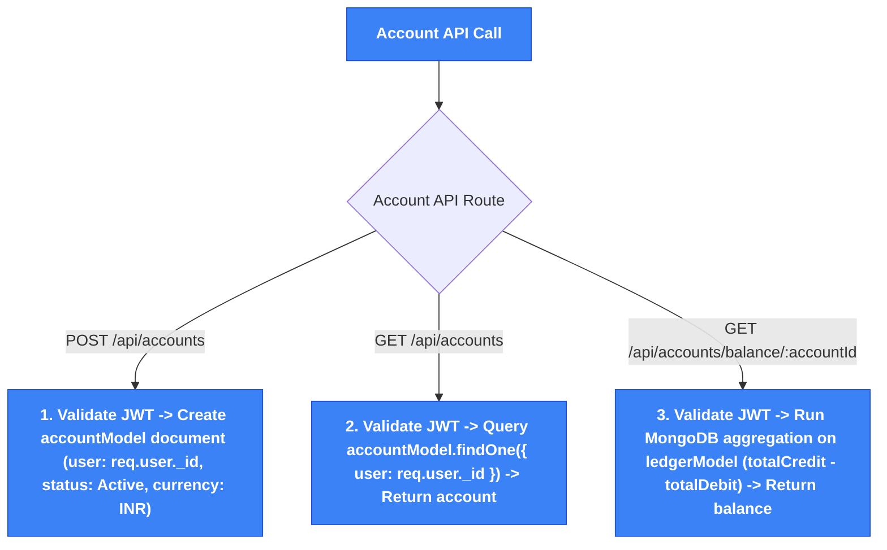
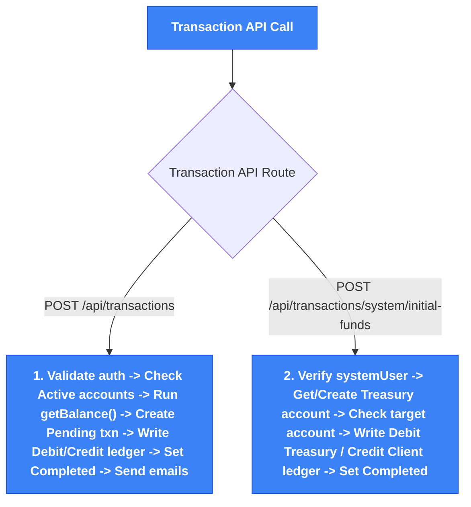
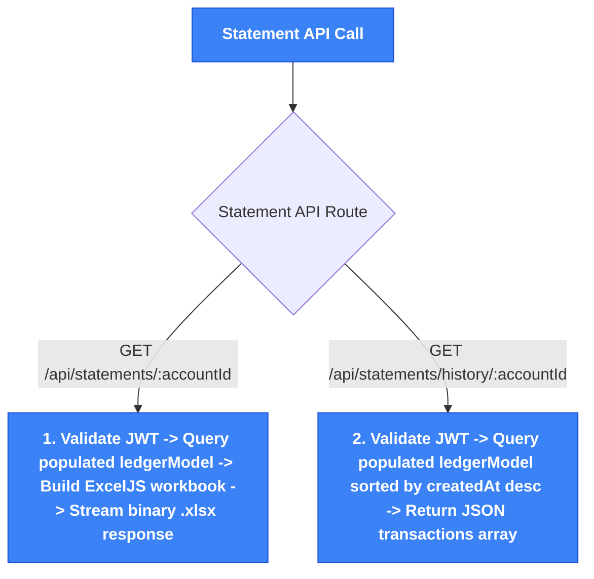

# 🚀 Backend Ledger: Double-Entry MERN Ledger & Banking System

<div align="center">


An advanced, minimal, and modern **full-stack banking & ledger web application** built with React, Tailwind CSS, shadcn/ui primitives, Node.js, Express 5, and MongoDB Atlas. Features secure OTP authentication, tab-isolated session state, live account balances derived from double-entry ledger entries, Recharts data analytics, a dedicated fund transfer workflow, Excel statement exports, and a System Admin workspace.

</div>

---

## 🗺️ System Architecture

The diagram below details the data flow and coordination between the React client, the Express 5 Node.js API server, and MongoDB database services:



---

## ✨ Core Features

### 🔐 Secure User Authentication & Verification
* **OTP Sign-Up & Password Reset**: 6-digit email OTP verification powered by Nodemailer & Gmail OAuth2.
* **Inline Validation**: React Hook Form + Zod validation with live password strength indicators and criteria checklists.
* **Token Blacklisting**: Logout invalidates JWT tokens via an indexed MongoDB token blacklist model.
* **Tab-Isolated Sessions**: Uses `sessionStorage` and an Axios `Authorization: Bearer <token>` interceptor to allow multiple accounts to run concurrently in separate browser tabs without session collision.

### 💼 Bank Account Provisioning & Management
* **Instant Account Opening**: One-click opening of bank accounts bound to authenticated user documents.
* **Double-Entry Ledger Aggregations**: Account balances are dynamically calculated from immutable debit and credit ledger entries via MongoDB aggregation pipelines.
* **Account Identifiers**: Masked account numbers with 1-click clipboard copy functionality.

### 📊 Live Account Dashboard & Recharts Analytics
* **Overview Cards**: Shows active account details, holder information, currency references, and toggleable balance visibility.
* **Live Stat Indicators**: Real-time cards for Current Balance, Total Transactions count, Last Transaction timestamp, and Account Status.
* **Cash Flow Trend (`AreaChart`)**: Visualizes Credits (received) vs Debits (sent) over time using Recharts.
* **Fund Distribution (`PieChart`)**: Interactive donut chart displaying received vs sent fund ratios.

### 💸 Instant Fund Transfer System
* **Live Validation**: Pre-submission checks for account existence, active status, and available balance.
* **Confirmation Dialog**: Interactive review modal before executing fund transfers.
* **Idempotency Protection**: Unique UUID-based idempotency keys prevent duplicate charges.

### 📜 Transaction History & Audit (`/transactions`)
* **Live Search & Filter**: Search transactions by ID or account ID, with dropdown filters for Type (Credit/Debit) and Status (Completed, Pending, Failed, Reversed).
* **Audit Modal**: Click any transaction row to view complete details, full counterparty account IDs, timestamps, and idempotency keys.

### 📄 Official Account Statement Exporter (`/statements`)
* **Excel (.xlsx) Export**: One-click download of official account statements generated and streamed dynamically via ExcelJS.

### 🛡️ System Admin Workspace (`/admin-dashboard`)
* **Role-Based Access**: System users (`systemUser: true`) are automatically routed to the Admin Dashboard upon authentication.
* **Unlimited Capital Disbursement**: Admin workspace allows initial fund seeding via `/api/transactions/system/initial-funds` without balance constraints.

---

## 📁 Repository Directory Structure

```text
├── backend/
│   ├── src/
│   │   ├── config/              # Database ODM configuration
│   │   │   └── db.js
│   │   ├── contollers/          # API route controllers
│   │   │   ├── account.controller.js
│   │   │   ├── auth.controller.js
│   │   │   ├── statement.controller.js
│   │   │   └── transaction.controller.js
│   │   ├── middlewares/         # Auth guards & middleware
│   │   │   └── auth.middleware.js
│   │   ├── models/              # Mongoose database models
│   │   │   ├── accountModel.js
│   │   │   ├── ledger.Model.js
│   │   │   ├── tokenBlackListModel.js
│   │   │   ├── transaction.model.js
│   │   │   └── userModel.js
│   │   ├── routes/              # Express route definitions
│   │   │   ├── account.routes.js
│   │   │   ├── auth.js
│   │   │   ├── statement.routes.js
│   │   │   └── transcation.routes.js
│   │   ├── services/            # Email & UUID services
│   │   │   ├── email.service.js
│   │   │   └── uuid.service.js
│   │   └── index.js
│   ├── server.js
│   └── package.json
└── frontend/
    ├── src/
    │   ├── components/
    │   │   ├── layout/
    │   │   │   └── AppLayout.jsx  # App shell with Sidebar & Navbar
    │   │   └── ui/                # shadcn/ui primitives (Button, Card, Dialog, Toast...)
    │   ├── hooks/
    │   │   └── use-toast.js
    │   ├── pages/
    │   │   ├── Register.jsx
    │   │   ├── VerifyOtp.jsx
    │   │   ├── Login.jsx
    │   │   ├── ForgotPassword.jsx
    │   │   ├── ResetPassword.jsx
    │   │   ├── Dashboard.jsx      # Dashboard with Recharts
    │   │   ├── Transfer.jsx       # Transfer Money
    │   │   ├── Transactions.jsx   # Transaction History & Search
    │   │   ├── Statements.jsx     # Excel Export
    │   │   └── AdminDashboard.jsx # System Admin workspace
    │   ├── services/
    │   │   └── api.js             # Axios client with interceptors
    │   ├── App.jsx
    │   ├── main.jsx
    │   └── index.css              # Purple design system & tokens
    ├── index.html
    ├── vite.config.js
    └── package.json
```

---

## 🔌 Core API Specifications

| Method | Endpoint | Description | Auth Required |
| :--- | :--- | :--- | :--- |
| **POST** | `/api/auth/register` | Registers a new user account and sends verification OTP | No |
| **POST** | `/api/auth/verify` | Verifies user email using the 6-digit OTP code | No |
| **POST** | `/api/auth/login` | Authenticates credentials and returns JWT token | No |
| **POST** | `/api/auth/logout` | Clears session cookie and blacklists active token | Yes |
| **POST** | `/api/auth/resend` | Resends activation OTP email | No |
| **POST** | `/api/auth/resetotp` | Generates a password recovery OTP email | No |
| **POST** | `/api/auth/resetpass` | Verifies recovery OTP and updates user password | No |
| **POST** | `/api/accounts` | Creates a new customer bank account for authenticated user | Yes |
| **GET** | `/api/accounts` | Fetches customer account associated with authenticated user | Yes |
| **GET** | `/api/accounts/balance/:accountId` | Aggregates double-entry ledger to calculate live balance | Yes |
| **POST** | `/api/transactions` | Initiates fund transfers between active customer accounts | Yes |
| **POST** | `/api/transactions/system/initial-funds` | Dispatches capital provisions from system treasury | Yes (Admin) |
| **GET** | `/api/statements/:accountId` | Generates and streams account statement Excel workbook (.xlsx) | Yes |
| **GET** | `/api/statements/history/:accountId` | Retrieves full ledger history for analytics and search | Yes |

---

## 🔄 Detailed API Execution Workflows

Below is the exhaustive, endpoint-by-endpoint workflow specification for every backend API endpoint in the system.

---

### 🔑 Authentication APIs (`/api/auth/*`)

#### 1. `POST /api/auth/register`
* **Purpose**: Registers a new user and dispatches an account activation OTP email.
* **Files**: [auth.js](file:///c:/Users/mibni/OneDrive/Desktop/Banking%20System/backend/src/routes/auth.js), [auth.controller.js](file:///c:/Users/mibni/OneDrive/Desktop/Banking%20System/backend/src/contollers/auth.controller.js), [userModel.js](file:///c:/Users/mibni/OneDrive/Desktop/Banking%20System/backend/src/models/userModel.js), [email.service.js](file:///c:/Users/mibni/OneDrive/Desktop/Banking%20System/backend/src/services/email.service.js)
* **Workflow**:
  1. Receives `{ name, email, password }` in request body.
  2. Queries `userModel.findOne({ email })`. If user already exists, returns `400 Email Already Exists`.
  3. Generates a random 6-digit numeric OTP via `userModel.generateOtp()` and sets expiry to `Date.now() + 5 * 60 * 1000` (5 minutes).
  4. Saves new user to MongoDB (`isVerified: false`). A Mongoose pre-save hook automatically hashes the password using `bcrypt` (10 salt rounds).
  5. Dispatches an account activation email containing the 6-digit OTP code using Nodemailer.
  6. Responds with `201 Created`.

#### 2. `POST /api/auth/verify`
* **Purpose**: Validates the 6-digit OTP code and activates the user account.
* **Files**: [auth.js](file:///c:/Users/mibni/OneDrive/Desktop/Banking%20System/backend/src/routes/auth.js), [auth.controller.js](file:///c:/Users/mibni/OneDrive/Desktop/Banking%20System/backend/src/contollers/auth.controller.js), [userModel.js](file:///c:/Users/mibni/OneDrive/Desktop/Banking%20System/backend/src/models/userModel.js)
* **Workflow**:
  1. Receives `{ email, otp }` in request body.
  2. Queries `userModel.findOne({ email }).select("+otp +otpExpiry")`.
  3. Returns `400 User not found` if email doesn't exist.
  4. Verifies `user.otp === otp` and `user.otpExpiry > Date.now()`. If invalid or expired, returns `400 Invalid OTP details`.
  5. Updates `user.isVerified = true`, clears `user.otp` and `user.otpExpiry`, and saves the document.
  6. Responds with `200 Account Verified Successfully`.

#### 3. `POST /api/auth/login`
* **Purpose**: Authenticates user credentials and generates a signed JWT session token.
* **Files**: [auth.js](file:///c:/Users/mibni/OneDrive/Desktop/Banking%20System/backend/src/routes/auth.js), [auth.controller.js](file:///c:/Users/mibni/OneDrive/Desktop/Banking%20System/backend/src/contollers/auth.controller.js), [userModel.js](file:///c:/Users/mibni/OneDrive/Desktop/Banking%20System/backend/src/models/userModel.js)
* **Workflow**:
  1. Receives `{ email, password }` in request body.
  2. Queries `userModel.findOne({ email }).select("+password")`.
  3. If user doesn't exist or `isVerified === false`, returns `400 Account not verified or invalid`.
  4. Compares plain password against stored hash via `bcrypt.compare`. If mismatch, returns `400 Invalid credentials`.
  5. Signs a JWT token containing `{ userId: user._id }` using `process.env.Jwt_Secret` (valid for 2 hours).
  6. Sets HTTP cookie `token` and returns `200 OK` with user details `{ _id, name, email }` and JWT token.

#### 4. `POST /api/auth/logout`
* **Purpose**: Terminates user session and blacklists the active JWT token.
* **Files**: [auth.js](file:///c:/Users/mibni/OneDrive/Desktop/Banking%20System/backend/src/routes/auth.js), [auth.controller.js](file:///c:/Users/mibni/OneDrive/Desktop/Banking%20System/backend/src/contollers/auth.controller.js), [tokenBlackListModel.js](file:///c:/Users/mibni/OneDrive/Desktop/Banking%20System/backend/src/models/tokenBlackListModel.js), [auth.middleware.js](file:///c:/Users/mibni/OneDrive/Desktop/Banking%20System/backend/src/middlewares/auth.middleware.js)
* **Workflow**:
  1. Middleware extracts JWT token from `Authorization: Bearer <token>` header or `req.cookies.token`.
  2. Creates a new document in `tokenBlackListModel` storing the active JWT token string.
  3. Clears browser cookie `token`.
  4. Responds with `200 User Logged Out Successfully`.

#### 5. `POST /api/auth/resend`
* **Purpose**: Generates and emails a fresh 6-digit activation OTP.
* **Files**: [auth.js](file:///c:/Users/mibni/OneDrive/Desktop/Banking%20System/backend/src/routes/auth.js), [auth.controller.js](file:///c:/Users/mibni/OneDrive/Desktop/Banking%20System/backend/src/contollers/auth.controller.js), [userModel.js](file:///c:/Users/mibni/OneDrive/Desktop/Banking%20System/backend/src/models/userModel.js), [email.service.js](file:///c:/Users/mibni/OneDrive/Desktop/Banking%20System/backend/src/services/email.service.js)
* **Workflow**:
  1. Receives `{ email }` in request body.
  2. Finds user in `userModel`. If missing or already verified, returns `400`.
  3. Generates new 6-digit OTP and 5-minute expiry timestamp. Saves updated user.
  4. Sends registration OTP email via Nodemailer and returns `200 OTP Sent Successfully`.

#### 6. `POST /api/auth/resetotp`
* **Purpose**: Generates a password recovery OTP and emails it to the user.
* **Files**: [auth.js](file:///c:/Users/mibni/OneDrive/Desktop/Banking%20System/backend/src/routes/auth.js), [auth.controller.js](file:///c:/Users/mibni/OneDrive/Desktop/Banking%20System/backend/src/contollers/auth.controller.js), [userModel.js](file:///c:/Users/mibni/OneDrive/Desktop/Banking%20System/backend/src/models/userModel.js), [email.service.js](file:///c:/Users/mibni/OneDrive/Desktop/Banking%20System/backend/src/services/email.service.js)
* **Workflow**:
  1. Receives `{ email }` in request body.
  2. Finds verified user in `userModel`. If missing, returns `404 User Not Found`.
  3. Generates 6-digit recovery OTP and 5-minute expiry. Saves updated user document.
  4. Calls `emailService.sendResetPasswordOtpEmail` via Nodemailer.
  5. Responds with `200 Password Reset OTP Sent`.

#### 7. `POST /api/auth/resetpass`
* **Purpose**: Verifies recovery OTP and updates the user's password.
* **Files**: [auth.js](file:///c:/Users/mibni/OneDrive/Desktop/Banking%20System/backend/src/routes/auth.js), [auth.controller.js](file:///c:/Users/mibni/OneDrive/Desktop/Banking%20System/backend/src/contollers/auth.controller.js), [userModel.js](file:///c:/Users/mibni/OneDrive/Desktop/Banking%20System/backend/src/models/userModel.js)
* **Workflow**:
  1. Receives `{ email, otp, password }` in request body.
  2. Finds user in `userModel` selecting `+otp +otpExpiry`.
  3. Validates OTP equality and non-expired timestamp.
  4. Assigns `user.password = password`. The Mongoose pre-save hook automatically hashes the new password with `bcrypt`.
  5. Clears `user.otp` and `user.otpExpiry`, saves document, and returns `200 Password Reset Successful`.



---

### 💼 Account APIs (`/api/accounts/*`)

#### 8. `POST /api/accounts`
* **Purpose**: Opens a new active customer bank account for the authenticated user.
* **Files**: [account.routes.js](file:///c:/Users/mibni/OneDrive/Desktop/Banking%20System/backend/src/routes/account.routes.js), [account.controller.js](file:///c:/Users/mibni/OneDrive/Desktop/Banking%20System/backend/src/contollers/account.controller.js), [accountModel.js](file:///c:/Users/mibni/OneDrive/Desktop/Banking%20System/backend/src/models/accountModel.js), [auth.middleware.js](file:///c:/Users/mibni/OneDrive/Desktop/Banking%20System/backend/src/middlewares/auth.middleware.js)
* **Workflow**:
  1. `authMiddleware` validates JWT token from header or cookie and attaches `req.user`.
  2. Calls `createAccountController`.
  3. Creates document in `accountModel` setting `user: req.user._id`, default status `"Active"`, default currency `"INR"`.
  4. Responds with `201 Created` containing created account object.

#### 9. `GET /api/accounts`
* **Purpose**: Retrieves the customer bank account details owned by the authenticated user.
* **Files**: [account.routes.js](file:///c:/Users/mibni/OneDrive/Desktop/Banking%20System/backend/src/routes/account.routes.js), [account.controller.js](file:///c:/Users/mibni/OneDrive/Desktop/Banking%20System/backend/src/contollers/account.controller.js), [accountModel.js](file:///c:/Users/mibni/OneDrive/Desktop/Banking%20System/backend/src/models/accountModel.js), [auth.middleware.js](file:///c:/Users/mibni/OneDrive/Desktop/Banking%20System/backend/src/middlewares/auth.middleware.js)
* **Workflow**:
  1. `authMiddleware` verifies JWT token.
  2. Queries `accountModel.findOne({ user: req.user._id })`.
  3. Responds with `200 OK` containing `{ accounts: accountDoc }`.

#### 10. `GET /api/accounts/balance/:accountId`
* **Purpose**: Aggregates double-entry ledger entries in real-time to compute the live account balance.
* **Files**: [account.routes.js](file:///c:/Users/mibni/OneDrive/Desktop/Banking%20System/backend/src/routes/account.routes.js), [account.controller.js](file:///c:/Users/mibni/OneDrive/Desktop/Banking%20System/backend/src/contollers/account.controller.js), [accountModel.js](file:///c:/Users/mibni/OneDrive/Desktop/Banking%20System/backend/src/models/accountModel.js), [ledger.Model.js](file:///c:/Users/mibni/OneDrive/Desktop/Banking%20System/backend/src/models/ledger.Model.js), [auth.middleware.js](file:///c:/Users/mibni/OneDrive/Desktop/Banking%20System/backend/src/middlewares/auth.middleware.js)
* **Workflow**:
  1. `authMiddleware` verifies JWT token.
  2. Finds account document matching `_id: accountId` and `user: req.user._id`. Returns `404 Account Not Found` if missing.
  3. Calls Mongoose model instance method `account.getBalance()`.
  4. `getBalance()` executes a MongoDB aggregation pipeline on `ledgerModel`:
     - `$match`: `{ account: accountId }`
     - `$group`: calculates `$totalDebit` (sum of `Debit` entries) and `$totalCredit` (sum of `Credit` entries)
     - `$project`: computes `balance = totalCredit - totalDebit`
  5. Returns `200 OK` with `{ accountId, balance }`.



---

### 💸 Transaction APIs (`/api/transactions/*`)

#### 11. `POST /api/transactions`
* **Purpose**: Performs an instant fund transfer between two customer bank accounts with double-entry ledger entries.
* **Files**: [transcation.routes.js](file:///c:/Users/mibni/OneDrive/Desktop/Banking%20System/backend/src/routes/transcation.routes.js), [transaction.controller.js](file:///c:/Users/mibni/OneDrive/Desktop/Banking%20System/backend/src/contollers/transaction.controller.js), [transaction.model.js](file:///c:/Users/mibni/OneDrive/Desktop/Banking%20System/backend/src/models/transaction.model.js), [ledger.Model.js](file:///c:/Users/mibni/OneDrive/Desktop/Banking%20System/backend/src/models/ledger.Model.js), [accountModel.js](file:///c:/Users/mibni/OneDrive/Desktop/Banking%20System/backend/src/models/accountModel.js), [email.service.js](file:///c:/Users/mibni/OneDrive/Desktop/Banking%20System/backend/src/services/email.service.js)
* **Workflow**:
  1. `authMiddleware` verifies JWT token.
  2. Receives `{ fromAccount, toAccount, amount }` in request body.
  3. Verifies `fromAccount !== toAccount`.
  4. Loads `fromUserAccount` and `toUserAccount` from `accountModel`. Verifies both accounts exist and have `status === "Active"`.
  5. Calls `fromUserAccount.getBalance()`. If `balance < amount`, triggers transaction failure email via Nodemailer and returns `400 Insufficient balance`.
  6. Generates unique idempotency key via `uuidv4()`.
  7. Creates `transactionModel` document (`status: "Pending"`).
  8. Creates two immutable atomic double-entry ledger records in `ledgerModel`:
     - Sender entry: `{ account: fromAccount, amount, transaction: txn._id, type: "Debit" }`
     - Recipient entry: `{ account: toAccount, amount, transaction: txn._id, type: "Credit" }`
  9. Updates `transactionModel` status to `"Completed"`.
  10. Triggers transaction success emails to both sender and recipient using Nodemailer.
  11. Responds with `201 Created`.

#### 12. `POST /api/transactions/system/initial-funds`
* **Purpose**: Dispatches initial capital provisions from the system treasury account to client accounts without balance constraints.
* **Files**: [transcation.routes.js](file:///c:/Users/mibni/OneDrive/Desktop/Banking%20System/backend/src/routes/transcation.routes.js), [transaction.controller.js](file:///c:/Users/mibni/OneDrive/Desktop/Banking%20System/backend/src/contollers/transaction.controller.js), [auth.middleware.js](file:///c:/Users/mibni/OneDrive/Desktop/Banking%20System/backend/src/middlewares/auth.middleware.js) (`authSystemUserMiddleware`), [accountModel.js](file:///c:/Users/mibni/OneDrive/Desktop/Banking%20System/backend/src/models/accountModel.js)
* **Workflow**:
  1. `authSystemUserMiddleware` validates JWT token and verifies `req.user.systemUser === true`. Returns `403 Not a System User` if unauthorized.
  2. Receives `{ toAccount, amount }` in request body.
  3. Queries system user's treasury bank account in `accountModel`. If none exists, creates a new active treasury account.
  4. Validates target `toAccount` exists and has `status === "Active"`.
  5. Bypasses sender balance check (system treasury has unlimited capital).
  6. Creates `transactionModel` record (`status: "Pending"`, unique idempotencyKey).
  7. Creates double-entry ledger entries in `ledgerModel`:
     - Treasury entry: `{ account: systemAccount._id, amount, transaction: txn._id, type: "Debit" }`
     - Client entry: `{ account: toAccount, amount, transaction: txn._id, type: "Credit" }`
  8. Updates transaction status to `"Completed"` and returns `200 OK`.



---

### 📄 Statement APIs (`/api/statements/*`)

#### 13. `GET /api/statements/:accountId`
* **Purpose**: Generates and streams an official account statement as an Excel workbook (`.xlsx`).
* **Files**: [statement.routes.js](file:///c:/Users/mibni/OneDrive/Desktop/Banking%20System/backend/src/routes/statement.routes.js), [statement.controller.js](file:///c:/Users/mibni/OneDrive/Desktop/Banking%20System/backend/src/contollers/statement.controller.js), [ledger.Model.js](file:///c:/Users/mibni/OneDrive/Desktop/Banking%20System/backend/src/models/ledger.Model.js)
* **Workflow**:
  1. `authMiddleware` validates JWT token.
  2. Queries `ledgerModel.find({ account: accountId }).populate("transaction").sort({ createdAt: -1 })`.
  3. Initializes `new ExcelJS.Workbook()` and adds worksheet `"Statement"`.
  4. Defines table columns: `Date`, `Transaction ID`, `From`, `To`, `Debit`, `Credit`, `Status`.
  5. Iterates through populated ledger entries, evaluating whether `transaction.fromAccount` matches `accountId` to populate the `Debit` column vs `Credit` column.
  6. Formats header row font (`bold: true`).
  7. Sets headers `Content-Type: application/vnd.openxmlformats-officedocument.spreadsheetml.sheet` and `Content-Disposition: attachment; filename=account_statement.xlsx`.
  8. Streams `workbook.xlsx.write(res)` directly to response output stream.

#### 14. `GET /api/statements/history/:accountId`
* **Purpose**: Retrieves full populated transaction history JSON for account analytics, search, and table views.
* **Files**: [statement.routes.js](file:///c:/Users/mibni/OneDrive/Desktop/Banking%20System/backend/src/routes/statement.routes.js), [statement.controller.js](file:///c:/Users/mibni/OneDrive/Desktop/Banking%20System/backend/src/contollers/statement.controller.js), [ledger.Model.js](file:///c:/Users/mibni/OneDrive/Desktop/Banking%20System/backend/src/models/ledger.Model.js)
* **Workflow**:
  1. `authMiddleware` validates JWT token.
  2. Queries `ledgerModel.find({ account: accountId }).populate("transaction").sort({ createdAt: -1 })`.
  3. Responds with `200 OK` containing `{ status: "Success", transactions: ledgerArray }`.



---

## ⚡ Quick Start

### 1. Clone & Configure Backend
```bash
cd backend
npm install
```
Create a `.env` file inside `backend/`:
```env
PORT=3000
MONGODB_URI=your_mongodb_connection_string
Jwt_Secret=your_jwt_secret
EMAIL_USER=your_email@gmail.com
CLIENT_ID=your_oauth_client_id
CLIENT_SECRET=your_oauth_client_secret
REFRESH_TOKEN=your_oauth_refresh_token
```

Start the backend:
```bash
npm start
```

### 2. Configure & Run Frontend
```bash
cd frontend
npm install
npm run dev
```
Open [http://localhost:5173](http://localhost:5173) in your browser.
