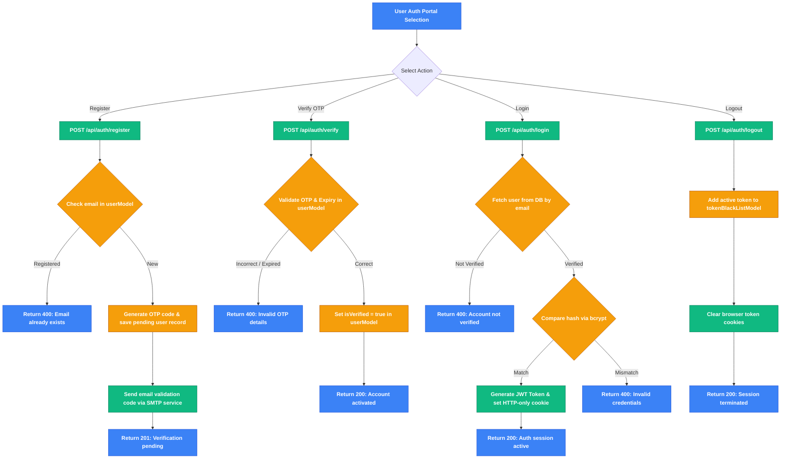
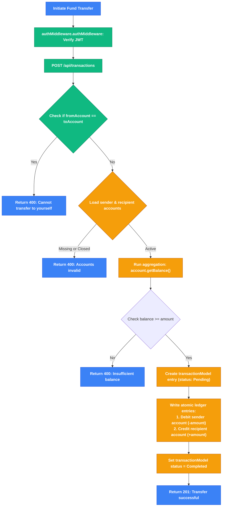
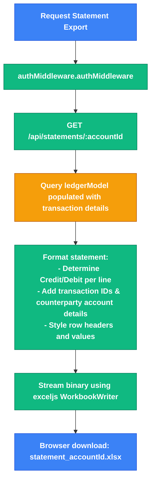
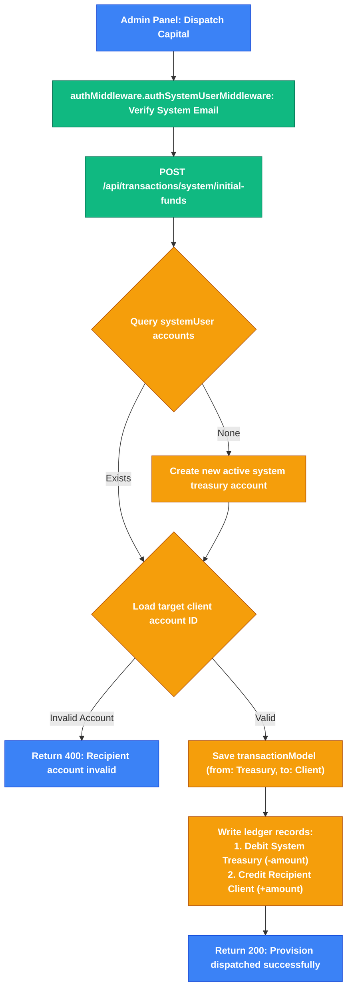

# 🚀 Oceanic Trust: Agentic MERN Ledger Banking System

<div align="center">


An advanced, high-fidelity **MERN stack banking web application** that supports secure user authentication with OTP email verification, multi-account creation and management, dynamic ledger aggregates, interactive SVG-based debit and credit analytics dashboards, a transaction simulation tracker, live Excel statement generation, and a dedicated system administrator workspace for capital provisions.

</div>

---

## 🗺️ System Architecture

The diagram below details the data flow and coordination between the React 19 client (Vite 8), the Express 5 Node.js API, and the MongoDB Atlas databases:

```mermaid
graph TD
    Client[React 19 Client / Vite 8] -->|1. Request / Auth / Transfer Action| Backend[Express 5 Backend / Node.js]
    Backend -->|2. Query / Aggregate Balance & Ledger| Database[(MongoDB Atlas / Mongoose)]
    Backend -->|3. Trigger OTP Verification Emails| EmailService[Nodemailer SMTP Service]
    Backend -->|4. Generate Workbook Binary| ExcelService[ExcelJS Streaming Exporter]
    ExcelService -->|5. Binary Download Stream (.xlsx)| Client
    Database -->|6. Calculate Live Balances| BalanceEngine["getBalance()
    Mongoose Ledger Aggregation Engine"]
    BalanceEngine -->|7. Balance Payload| Backend
    Backend -->|8. Signed Cookie / JWT / Session State| Client
```

---

## ✨ Core Features

### 🔐 Secure User Authentication & Verification
* **OTP Sign-Up Guard**: Employs registration OTP checks sent via SMTP (Gmail) to verify customer identities before activating profile states.
* **Password Resets**: Safe forgot-password workflow leveraging temporary OTP codes.
* **JWT Token Security**: Utilizes JSON Web Tokens stored in browser cookies for authenticating client sessions, backed by an index-based token blacklist model that invalidates logged-out tokens.
* **Cross-Tab Session Isolation**: Eliminates cross-tab session overwrite conflicts by managing session tokens through `sessionStorage` in parallel with cookie clears.

### 💼 Multi-Account Selector Grid
* **Multi-Account Bindings**: Allows users to open and manage multiple checking or savings accounts under a single login.
* **Balance Aggregations**: Queries the backend on-the-fly to calculate current funds per account directly from the database ledger.
* **Account Provisioning**: Instant creation of new active account documents with dynamic currency references (INR).

### 📊 Live Account Dashboard
* **Sleek Bank Cards**: Shows active bank cards for selected account IDs, status badges, and copyable identifier controls.
* **Counter Analytics**: Displays indicators for total transaction counts, debits count, and credits count.
* **Recent Summary Table**: Renders the latest 5 transaction records associated with the account, mapping counterparty accounts and amounts dynamically.
* **Quick Access Navs**: Built-in redirection controls for money transfers, statement downloads, and analytical dashboards.

### 📈 Inflow & Outflow Analytics
* **Interactive HSL SVG Charts**: Two dedicated analytics views (Debits and Credits) showing HSL gradients representing volume changes over the last 7 calendar days.
* **Micro-Interactive Tooltips**: Hover highlights presenting exact decimal volumes.
* **Instant Keyword Filter**: Search bar filters statement histories dynamically by transaction ID, counterpart accounts, or exact transaction amounts.

### 💸 Simulated Fund Transfer System
* **Express Validation**: Confirms recipient account validity, active states, and sender balance limits on the backend.
* **15-Second Simulation Step Tracker**: Visual status board outlining the atomic phases of banking transfers:
  1. *Validation & Balance Check*
  2. *Database Session Locking*
  3. *Debit Entry Processing*
  4. *Credit Entry Processing*
  5. *Committal & Receipts*
* **Automatic Redirects**: Re-routes users back to the dashboard upon successful committal.

### 🛡️ Treasury Control & Provision Control Panel
* **Protected Administrator Dashboard**: Restricts access to user accounts containing emails listed under `VITE_ADMIN_EMAILS`.
* **Treasury Ledger Pool**: Enables admins to initialize the system treasury account and check its aggregate balance.
* **Capital Dispatch Operations**: Allows admins to inject initial capital provisions into user accounts, creating matching credit/debit ledger entries in the database.

---

## 📁 Repository Directory Structure

```text
├── backend/
│   ├── src/
│   │   ├── config/              # MongoDB connection configurations
│   │   │   └── db.js            # Mongoose ODM connection setup
│   │   ├── contollers/          # Business logic handlers
│   │   │   ├── account.controller.js
│   │   │   ├── auth.controller.js
│   │   │   ├── statement.controller.js
│   │   │   └── transaction.controller.js
│   │   ├── middlewares/         # Authorization checks & Route guards
│   │   │   └── auth.middleware.js
│   │   ├── models/              # Mongoose database models & schemas
│   │   │   ├── accountModel.js
│   │   │   ├── ledger.Model.js
│   │   │   ├── tokenBlackListModel.js
│   │   │   ├── transaction.model.js
│   │   │   └── userModel.js
│   │   ├── routes/              # Mounted Express endpoints
│   │   │   ├── account.routes.js
│   │   │   ├── auth.js
│   │   │   ├── statement.routes.js
│   │   │   └── transcation.routes.js
│   │   ├── services/            # Supporting logic modules
│   │   │   ├── email.service.js # SMTP NodeMailer transport configurations
│   │   │   └── uuid.service.js  # Transaction idempotency generators
│   │   ├── create-admin.js      # Utility script to register administrative accounts
│   │   └── index.js             # Route mapping and middleware configurations
│   ├── .env                     # Backend environment variables configuration
│   └── server.js                # Server entry point and port listener
└── frontend/
    ├── src/
    │   ├── components/          # Reusable shared layout elements
    │   ├── pages/               # Page views & dashboards
    │   │   ├── Landing.jsx      # Marketing Landing View
    │   │   ├── Login.jsx        # Credentials authentication
    │   │   ├── Register.jsx     # Registration screen
    │   │   ├── VerifyOtp.jsx    # Registration OTP verification
    │   │   ├── ForgotPassword.jsx # Password recovery portal
    │   │   ├── AccountSelector.jsx # Selection grid for multiple profiles
    │   │   ├── Dashboard.jsx    # Primary user account console
    │   │   ├── Transfer.jsx     # Fund transfer screen with step tracker
    │   │   ├── DebitAnalytics.jsx # Outflow bar chart & list search
    │   │   ├── CreditAnalytics.jsx # Inflow bar chart & list search
    │   │   └── AdminDashboard.jsx # System administrator control panel
    │   ├── App.css              # Custom navigation overrides
    │   ├── App.jsx              # Routing config, user contexts, and guards
    │   ├── index.css            # Custom CSS styling system with HSL variables
    │   └── main.jsx             # React rendering hook
```

---

## ⚙️ Prerequisites & Environment Variables

Configure the following environment variables to run the application locally:

### Backend Configuration
Create a `.env` file in the `backend/` directory:
```env
# MongoDB Connection URI (Local database or Atlas Cluster)
Mongo_URI=your_mongodb_connection_uri_here

# JWT Secret key for authentication token hashing
Jwt_Secret=your_jwt_signing_key_here

# Gmail OAuth Credentials (for Nodemailer OTP emails dispatch)
CLIENT_ID=your_gmail_oauth_client_id
CLIENT_SECRET=your_gmail_oauth_client_secret
REFRESH_TOKEN=your_gmail_oauth_refresh_token
EMAIL_USER=your_dispatch_gmail_address
```

### Frontend Configuration
Create a `.env` file in the `frontend/` directory:
```env
# URL target of your backend API server (Empty uses local Vite Proxy)
VITE_API_BASE_URL=

# Comma-separated list of administrative email roles
VITE_ADMIN_EMAILS=nihar3611@gmail.com,admin@oceanic.com,niharni02@gmail.com
```

---

## 🚀 Getting Started

Follow these steps to run the application locally:

### 1. Run the Backend API
Navigate to the `backend` folder, install the dependencies, and start the Nodemon server:
```bash
cd backend
npm install
npm start
```
*(The backend server will connect to MongoDB and start listening on port `3000`)*

### 2. Run the Frontend Client
Open a new terminal, navigate to the `frontend` folder, install the packages, and launch Vite:
```bash
cd frontend
npm install
npm run dev
```
*(The client application will start running on port `5173`)*

---

## 🔌 Core API Specifications

| Method | Endpoint | Description | Auth Required |
| :--- | :--- | :--- | :--- |
| **POST** | `/api/auth/register` | Registers a new user account | No |
| **POST** | `/api/auth/verify` | Verifies user account using SMTP OTP | No |
| **POST** | `/api/auth/login` | Authenticates user credentials and sets token cookie | No |
| **POST** | `/api/auth/logout` | Clears local cookies and blacklists the token | Yes |
| **POST** | `/api/auth/resend` | Resends account activation OTP code | No |
| **POST** | `/api/auth/resetotp` | Generates a password recovery OTP code | No |
| **POST** | `/api/auth/resetpass` | Verifies recovery OTP and updates user password | No |
| **POST** | `/api/accounts` | Creates a new customer bank account | Yes |
| **GET** | `/api/accounts` | Lists all accounts owned by the authenticated user | Yes |
| **GET** | `/api/accounts/balance/:accountId` | Performs ledger aggregates to calculate live balance | Yes |
| **POST** | `/api/transactions` | Initiates fund transfers (15s simulated delay) | Yes |
| **POST** | `/api/transactions/system/initial-funds` | Dispatches initial funds from system treasury | Yes (Admin) |
| **GET** | `/api/statements/:accountId` | Generates and streams account statement Excel book | Yes |
| **GET** | `/api/statements/history/:accountId` | Retrieves full transaction lists for analytics & charts | Yes |

---

## 🔄 Detailed Feature & API Workflows

This section maps out step-by-step data flows for key features, connecting frontend states, backend controllers, middleware guards, and MongoDB schema queries.

### 🔑 1. User Authentication & Verification Flow
Manages registration, secure OTP validation, sign-ins, and session blacklists.



---

### 💸 2. Transaction Processing & Isolation Flow
Examines isolation checks, debit validation, and updates to the ledger.



---

### 📑 3. Live Statement Workbook Exporter Flow
Aggregates ledger rows and streams formatted spreadsheets dynamically.



---

### 🛡️ 4. System Treasury Capital Injection Flow
Injects initial funds from the system treasury account to client accounts.


